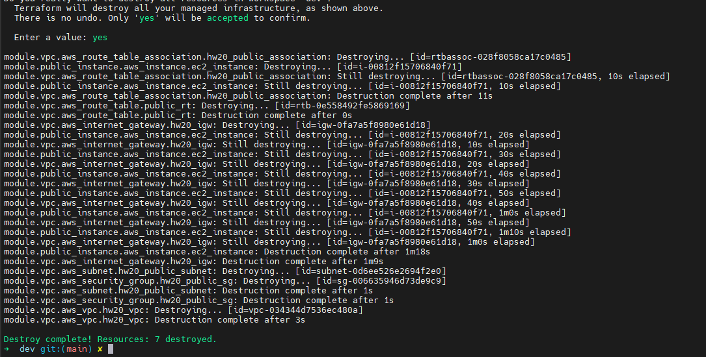
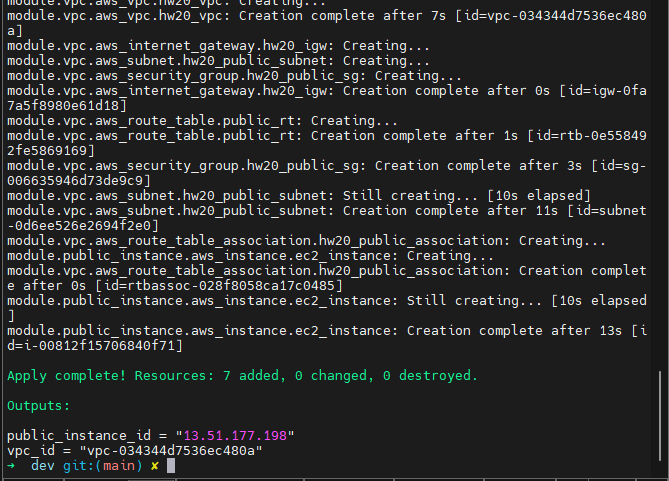
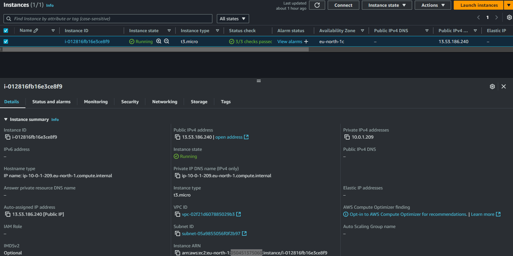
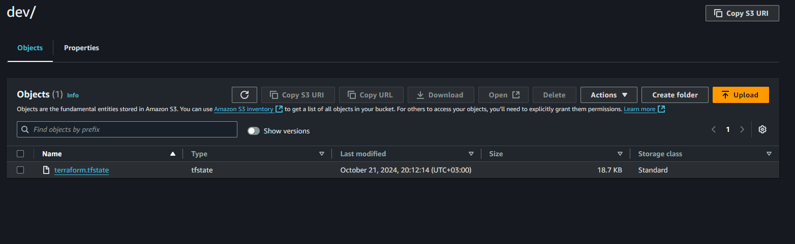
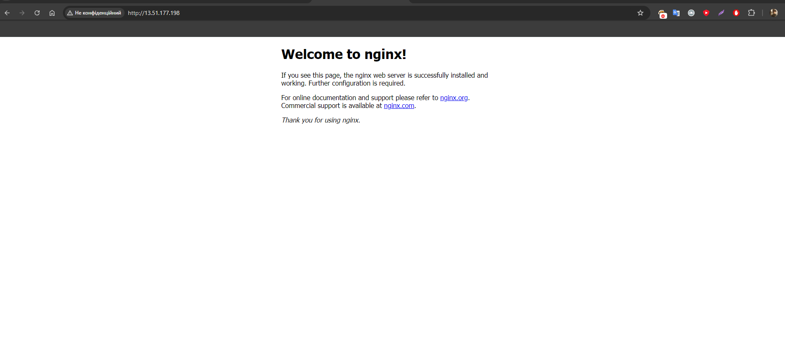

# Terraform Project for Managing Multiple Environments

Цей проєкт побудований для управління інфраструктурою AWS за допомогою **Terraform**, що підтримує кілька середовищ, таких як **dev**, **stage**, і **prod**. Проєкт включає модулі для створення **VPC** та **EC2 інстансів** з можливістю налаштування через змінні.

## Структура проєкту

```plaintext
.
├── src/
│   └── terraform/
│       ├── envs/
│       │   ├── dev/
│       │   │   ├── scripts/           # Скрипти для середовища dev
│       │   │   ├── backend.tf         # Налаштування для S3 бекенду
│       │   │   ├── locals.tf          # Локальні змінні для середовища dev
│       │   │   ├── main.tf            # Основна конфігурація Terraform для dev
│       │   │   ├── outputs.tf         # Вихідні значення для середовища dev
│       │   │   ├── terraform.tfvars   # Змінні для середовища dev
│       │   │   └── variables.tf       # Оголошення змінних для середовища dev
│       │   ├── prod/                  # Аналогічні файли для prod
│       │   └── stage/                 # Аналогічні файли для stage
│       ├── modules/
│       │   ├── ec2/                   # Модуль для створення EC2 інстансів
│       │   └── vpc/                   # Модуль для створення VPC
│       ├── backend-init.tf            # Ініціалізація S3 та DynamoDB для зберігання стану
│       ├── outputs.tf                 # Виведення глобальних значень
│       └── variables.tf               # Оголошення змінних для всього проєкту
├── screens/
│   ├── 1.png                          # Зображення з процесом виконання
│   ├── 2.png                          # EC2 інстанс у консолі AWS
│   └── 3.png                          # Встановлений Nginx на інстансі
└── README.md                          # Опис проекту та інструкції з використання
```

## Основні каталоги:

- **`envs/`**: Містить конфігурації для кожного середовища (**dev**, **stage**, **prod**). Кожне середовище має свої змінні та налаштування.
- **`modules/`**: Містить модулі для створення **VPC** та **EC2 інстансів**, що можуть використовуватися в будь-якому середовищі.
- **`scripts/`**: Містить скрипти для автоматичного встановлення сервісів на EC2 інстансах, наприклад **Nginx**.
- **`backend-init.tf`**: Файл для створення **S3 бакету** і **DynamoDB таблиці**, що використовуються для зберігання стану Terraform і блокування.
  
## Інструкції з запуску

1. **Ініціалізуйте проєкт та створіть ресурси для зберігання стану**:
    ```bash
    cd src
    terraform init
    terraform apply
    ```

2. **Налаштування інфраструктури для конкретного середовища** (наприклад, для dev):
    ```bash
    cd envs/dev
    terraform init
    terraform apply
    ```

3. **Видалення ресурсів**:
    Для видалення ресурсів для конкретного середовища виконайте:
    ```bash
    cd envs/dev
    terraform destroy
    ```
   

    Для видалення глобальних ресурсів, виконайте:
    ```bash
    cd src
    terraform destroy
    ```
   

## Опис модулів

### Модуль VPC

**Модуль `vpc`** створює:

- **VPC** з обраним CIDR блоком.
- **Публічну підмережу** з можливістю призначення публічних IP-адрес.
- **Інтернет-шлюз** для забезпечення доступу до інтернету.
- **Маршрутну таблицю**, що включає маршрут до інтернет-шлюзу.
- **Security Group**, що дозволяє доступ до вказаних портів.

### Модуль EC2

**Модуль `ec2`** відповідає за:

- Створення EC2 інстансу з вибраним **AMI** та **типом інстансу**.
- Призначення **публічної IP-адреси** та підключення до Security Group.
- Виконання скриптів через **User Data** для встановлення сервісів, таких як **Nginx**.

## Результати

### Процес виконання:



### EC2 інстанс у консолі AWS:



### Створений Backet:



### Встановлений Nginx на інстансі:



## Важливі моменти

1. **Зберігання стану**: Terraform використовує **S3** для зберігання стану та **DynamoDB** для блокування змін, що забезпечує безпеку та уникнення конфліктів при паралельних операціях.
2. **Модульність**: Модулі дозволяють використовувати один і той самий код для різних середовищ, що підвищує масштабованість та гнучкість інфраструктури.
3. **Підтримка кількох середовищ**: Кожне середовище (наприклад, **dev**, **stage**, **prod**) має свої конфігурації, що дозволяє тестувати зміни перед застосуванням у виробничому середовищі.
4. **Використання циклу для відкриття портів**: У модулі VPC використовується цикл для автоматичного відкриття портів зі списку **`list_of_open_ports`**. Це дозволяє гнучко налаштовувати правила для **Security Group**, відкриваючи порти, необхідні для роботи додатків (наприклад, порти **80** для HTTP та **443** для HTTPS). 

   Приклад коду для відкриття портів:

   ```hcl
   dynamic "ingress" {
     for_each = toset(var.list_of_open_ports)
     content {
       from_port   = ingress.value
       to_port     = ingress.value
       protocol    = "tcp"
       cidr_blocks = ["0.0.0.0/0"]
     }
   }
   ```