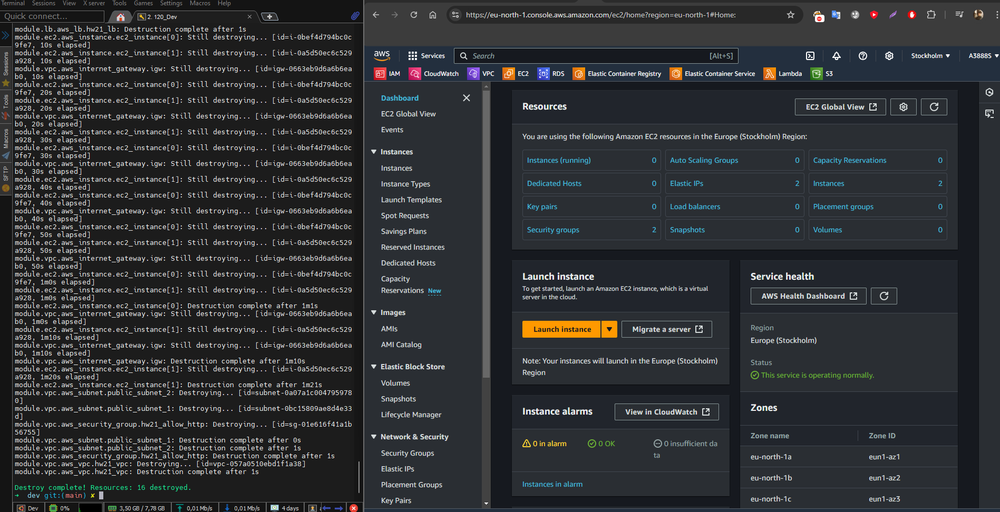
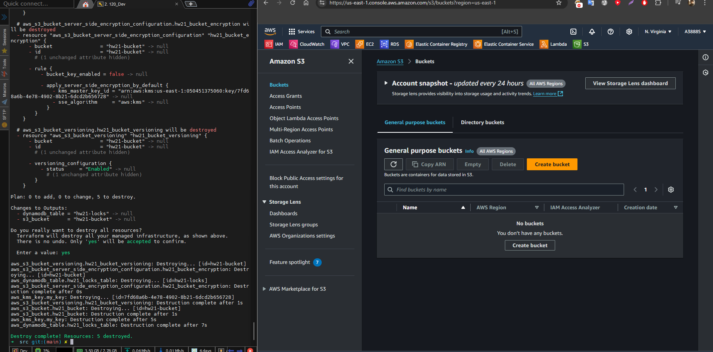
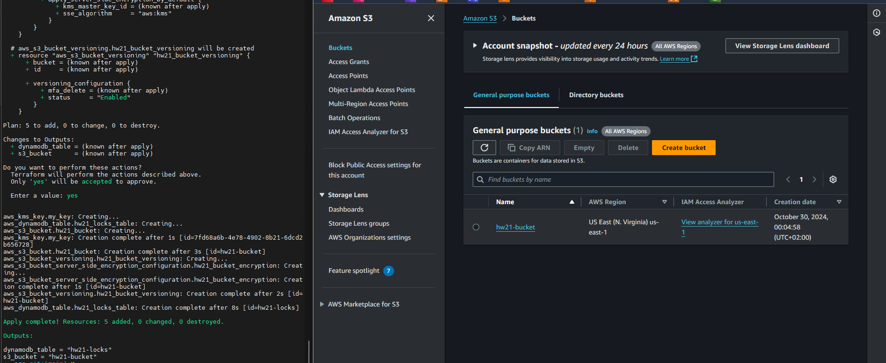
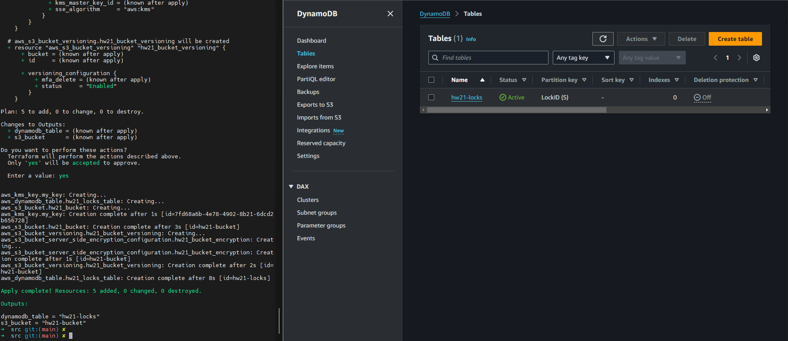
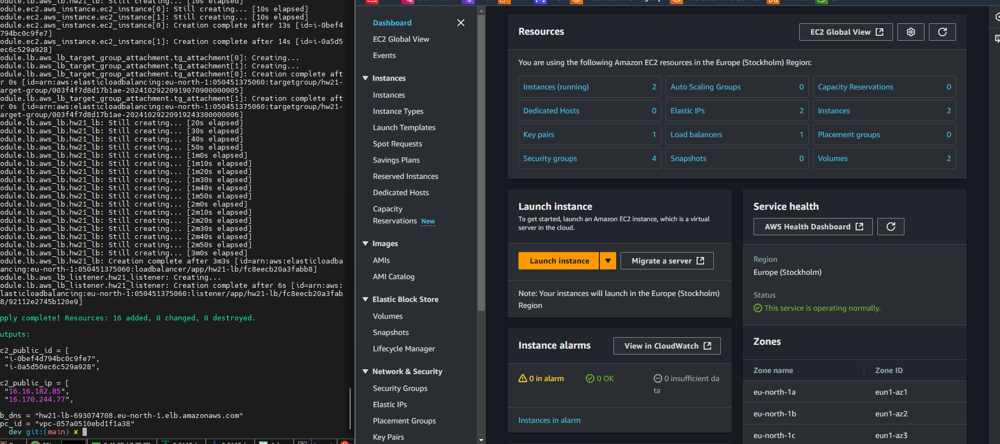
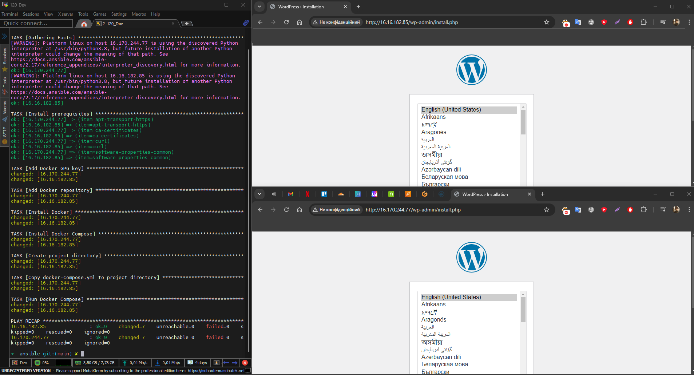
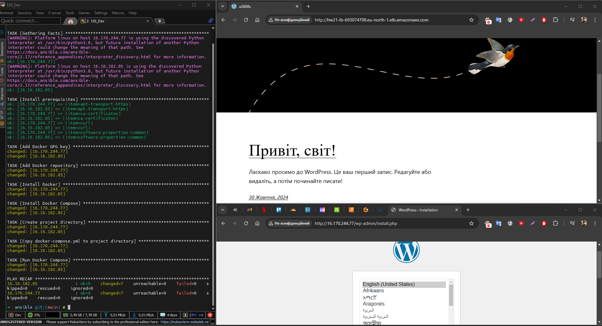

# Terraform Project for Managing Multiple Environments

Цей проєкт побудований для управління інфраструктурою AWS за допомогою **Terraform**, що підтримує кілька середовищ, таких як **dev**, **stage**, і **prod**. Проєкт включає модулі для створення **VPC**, **EC2 інстансів**, **LB** та **S3 з DynamoDB для зберігання стану**, а також автоматизацію розгортання WordPress через **Ansible**.

## Структура проєкту

```plaintext
HW-21/
├── src/
│   └── envs/
│       ├── dev/
│       │   ├── ansible/
│       │   │   ├── docker-compose.yml      # Docker Compose для WordPress
│       │   │   ├── inventory               # Інвентар Ansible для цільових серверів
│       │   │   ├── wordpress_playbook.yml  # Playbook для налаштування Docker і WordPress
│       │   │   └── terraform.tfstate       # Стан Terraform для середовища dev
│       │   ├── backend.tf                  # Конфігурація бекенду S3 для зберігання стану
│       │   ├── locals.tf                   # Локальні змінні для тегування ресурсів
│       │   ├── main.tf                     # Основна конфігурація Terraform
│       │   ├── outputs.tf                  # Вихідні значення для середовища dev
│       │   ├── terraform.tfvars            # Змінні для середовища dev
│       │   └── variables.tf                # Оголошення змінних для середовища dev
│       ├── prod/                           # Аналогічні файли для середовища prod
│       └── stage/                          # Аналогічні файли для середовища stage
│   ├── modules/
│   │   ├── ec2/                            # Модуль для створення EC2 інстансів
│   │   ├── load_balancer/                  # Модуль для створення Load Balancer
│   │   └── vpc/                            # Модуль для створення VPC
└── README.md                               # Опис проекту та інструкції з використання
```

## Основні каталоги

- **`envs/`**: Містить окремі конфігурації для середовищ **dev**, **stage**, **prod** з унікальними змінними, ресурсами та параметрами.
- **`modules/`**: Містить модулі для **VPC**, **EC2**, і **Load Balancer**. Модульна структура спрощує повторне використання та масштабування.
- **`ansible/`**: Містить файли для автоматичного розгортання WordPress через **Docker Compose** на EC2.
  
## Інструкції з розгортання

### Попередні налаштування

- **Terraform**: Встановіть Terraform (версія >= 1.0).
- **Ansible**: Встановіть Ansible (версія >= 2.9).
- **AWS CLI**: Налаштуйте AWS CLI з відповідними обліковими даними.
- **SSH Key**: Переконайтеся, що ваш закритий ключ знаходиться в `~/.ssh/id_rsa` для підключення через Ansible.

### Кроки розгортання

1. **Ініціалізація бекенду та створення базових ресурсів**:
   ```bash
   cd src
   terraform init
   terraform apply
   ```

2. **Налаштування інфраструктури для конкретного середовища** (наприклад, для dev):
   ```bash
   cd envs/dev
   terraform init
   terraform apply
   ```

3. **Розгортання WordPress за допомогою Ansible**:
   Після створення інфраструктури, скористайтеся Ansible для встановлення Docker та розгортання WordPress.
   ```bash
   ansible-playbook -i src/envs/dev/ansible/inventory src/envs/dev/ansible/wordpress_playbook.yml
   ```

4. **Перевірка розгорнутої WordPress**:
   Отримайте DNS Load Balancer із виведених значень Terraform і відкрийте в браузері:
   ```bash
   http://<LoadBalancerDNS>
   ```

### Очистка ресурсів

Щоб видалити ресурси середовища:
```bash
cd envs/dev
terraform destroy
```


Щоб видалити глобальні ресурси:
```bash
cd src
terraform destroy
```


## Опис модулів

### Модуль VPC

**Модуль `vpc`** включає:
- **VPC** з обраним CIDR блоком.
- **Публічну підмережу** з можливістю призначення публічних IP.
- **Інтернет-шлюз** для доступу в інтернет.
- **Маршрутну таблицю** з маршрутом до інтернет-шлюзу.
- **Security Group** для дозволу необхідних портів.

### Модуль EC2

**Модуль `ec2`**:
- Створює EC2 інстанси з потрібними **AMI** та **типом інстансу**.
- Призначає публічні IP-адреси і додає Security Group.
- Налаштовує базові сервіси за допомогою **User Data**.

### Модуль Load Balancer

**Модуль `load_balancer`** створює:
- **Application Load Balancer** для розподілу навантаження.
- **Target Group** для розподілу трафіку між інстансами.
- **Listener** для прослуховування порту 80 (HTTP).

## Приклади та результати

### Створений S3 бакет


### Створений DynamoDB Table


### Розгорнуто інфраструктуру


### Встановлений WordPress на інстансах


### Перевірка роботи Load Balancer


## Важливі моменти

1. **Зберігання стану**: Terraform використовує **S3** для стану та **DynamoDB** для блокування, що гарантує уникнення конфліктів.
2. **Модульність**: Модульна структура дозволяє легко масштабувати проєкт та адаптувати його для різних середовищ.
3. **Підтримка кількох середовищ**: У кожного середовища (dev, stage, prod) свої конфігурації, що дозволяє тестувати зміни перед застосуванням у продакшн.
4. **Адаптивне відкриття портів**: Використання циклів у Security Group для автоматичного відкриття необхідних портів зі списку змінних.

   ```hcl
   dynamic "ingress" {
     for_each = toset(var.list_of_open_ports)
     content {
       from_port   = ingress.value
       to_port     = ingress.value
       protocol    = "tcp"
       cidr_blocks = ["0.0.0.0/0"]
     }
   }
   ```

5. **Використання Load Balancer для розподілу трафіку**: 
   Проєкт використовує **Application Load Balancer** для балансування навантаження між EC2 інстансами, що забезпечує розподіл трафіку і підвищує надійність. **Load Balancer** також спрощує доступ до WordPress, надаючи один публічний DNS.

6. **Обмеження структури через відсутність централізованої бази даних**: 
   Поточна інфраструктура передбачає зберігання даних WordPress на кожному окремому інстансі, що не є ефективним. Відсутність централізованої бази даних призводить до проблем зі збереженням та синхронізацією даних між інстансами. Для покращення інфраструктури слід впровадити централізовану базу даних, наприклад, **Amazon RDS**, щоб усі інстанси мали доступ до єдиного сховища даних.