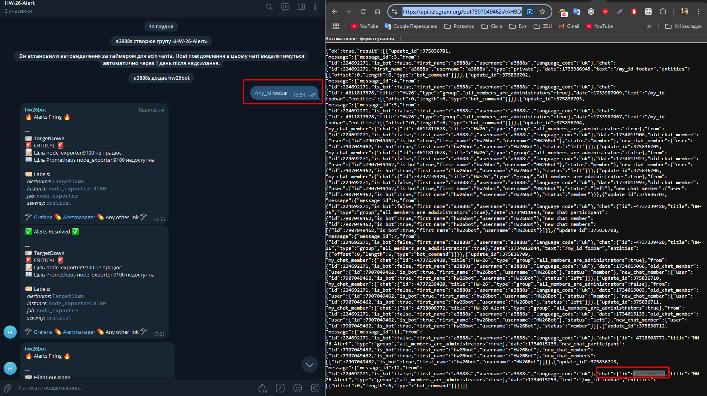
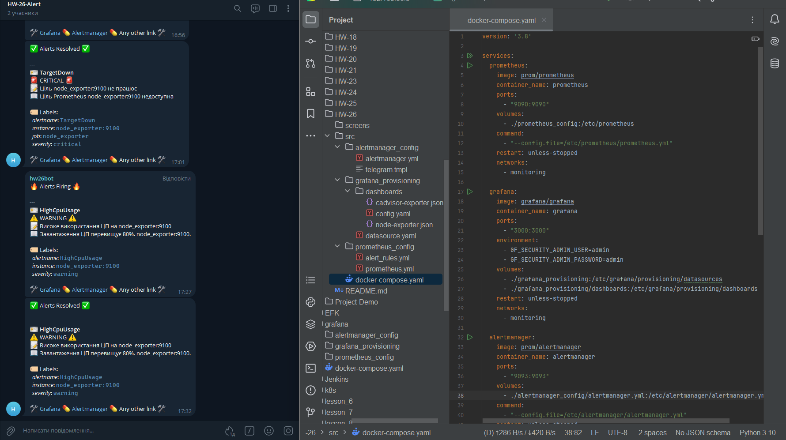
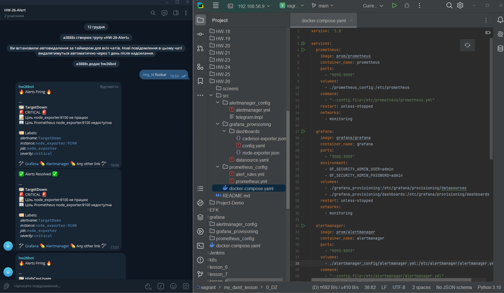

# HW-26

Проект налаштовує стек моніторингу за допомогою Docker. Стек включає Prometheus, Grafana, Alertmanager та експортери для моніторингу контейнерів і системних метрик. Крім того, проект містить попередньо налаштовані дашборди та оповіщення для ефективного моніторингу.

---

## Структура проекту

```
src/
├── alertmanager_config/
│   └── alertmanager.yml
├── docker-compose.yml
├── grafana_provisioning/
│   ├── dashboards/
│   │   ├── cadvisor-exporter.json
│   │   ├── node-exporter.json
│   │   └── config.yaml
│   └── datasource.yaml
├── prometheus_config/
│   ├── prometheus.yml
│   └── alert_rules.yml
```

- **`docker-compose.yml`**: Файл Docker Compose для оркестрації сервісів.
- **`alertmanager_config/alertmanager.yml`**: Конфігурація Alertmanager.
- **`grafana_provisioning/datasource.yaml`**: Конфігурація джерел даних Grafana.
- **`grafana_provisioning/dashboards/`**: Попередньо налаштовані дашборди для Grafana.
- **`prometheus_config/prometheus.yml`**: Конфігураційний файл Prometheus.
- **`prometheus_config/alert_rules.yml`**: Правила оповіщення для Prometheus.

---

## Покрокове виконання

### 1. Клонування репозиторію
```bash
git clone https://gitlab.com/my_dan.it/my_danit_lesson.git
cd HW-26/src
```

### 2. Налаштування Alertmanager

1. Відкрити файл `alertmanager_config/alertmanager.yml`.
2. Замінити `<YOUR_BOT_TOKEN>` і `<YOUR_CHAT_ID>` на токен Telegram-бота та ID чату.
3. Створити телеграм бота та отримати токен.

4. Створити групу, додати бота, отримати chat id. [https://api.telegram.org](https://api.telegram.org/bot<YOUR_BOT_TOKEN>/getUpdates)


### 3. Запуск моніторингового стеку

Запуск усіх сервісів командою:
```bash
docker-compose up -d
```

### 4. Доступ до сервісів

- **Prometheus**: [http://localhost:9090](http://localhost:9090)
- **Grafana**: [http://localhost:3000](http://localhost:3000)
  - Облікові дані за замовчуванням:
    - Логін: `admin`
    - Пароль: `admin`
- **Alertmanager**: [http://localhost:9093](http://localhost:9093)
- **cAdvisor**: [http://localhost:8080](http://localhost:8080)

### 5. Імпорт дашбордів у Grafana

Проект включає попередньо налаштовані дашборди для:
- **Node Exporter**: Моніторинг системних метрик (CPU, пам'ять, диск тощо).
- **cAdvisor**: Моніторинг Docker-контейнерів.

Ці дашборди автоматично завантажуються під час запуску Grafana з директорії `grafana_provisioning/dashboards`.

### 6. Налаштування оповіщень

Наступні оповіщення налаштовані у файлі `prometheus_config/alert_rules.yml`:

- **Мало місця на диску**: Спрацьовує, коли вільного місця на диску менше 15%.
- **Високе завантаження CPU**: Спрацьовує, коли завантаження CPU перевищує 80%.
- **Недоступний таргет**: Спрацьовує, коли хоча б один із таргетів Prometheus недоступний.

### 7. Тестування оповіщень

Симулювання умов для спрацювання оповіщень та перевірте отримання повідомлень у Telegram:

- **Мало місця на диску**:
  Заповнення диска великим файлом:
  ```bash
  dd if=/dev/zero of=/tmp/testfile bs=1M count=10000
  ```

- **Високе завантаження CPU**:
  Генерування навантаження на CPU:
  ```bash
  stress --cpu 4 --timeout 60
  ```
  

- **Недоступний таргет**:
  Зупинка одного з експортерів:
  ```bash
  docker stop node_exporter
  ```
  

---

## Усунення несправностей

### Перевірка логів

Команди для перегляду логів окремих сервісів:
```bash
docker logs prometheus
docker logs grafana
docker logs alertmanager
```

### Перевірка підключення

Cервіси можуть взаємодіяти в мережі `monitoring`:
```bash
docker exec -it prometheus curl http://node_exporter:9100/metrics
```

### Налагодження оповіщень

Cторінка `Alerts` у Prometheus для налагодження активних оповіщень: [http://localhost:9090/alerts](http://localhost:9090/alerts).

---