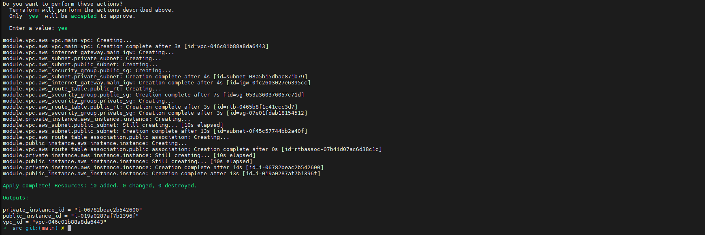
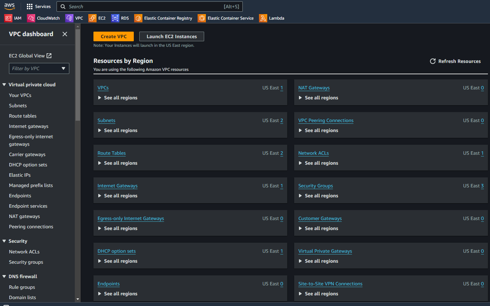
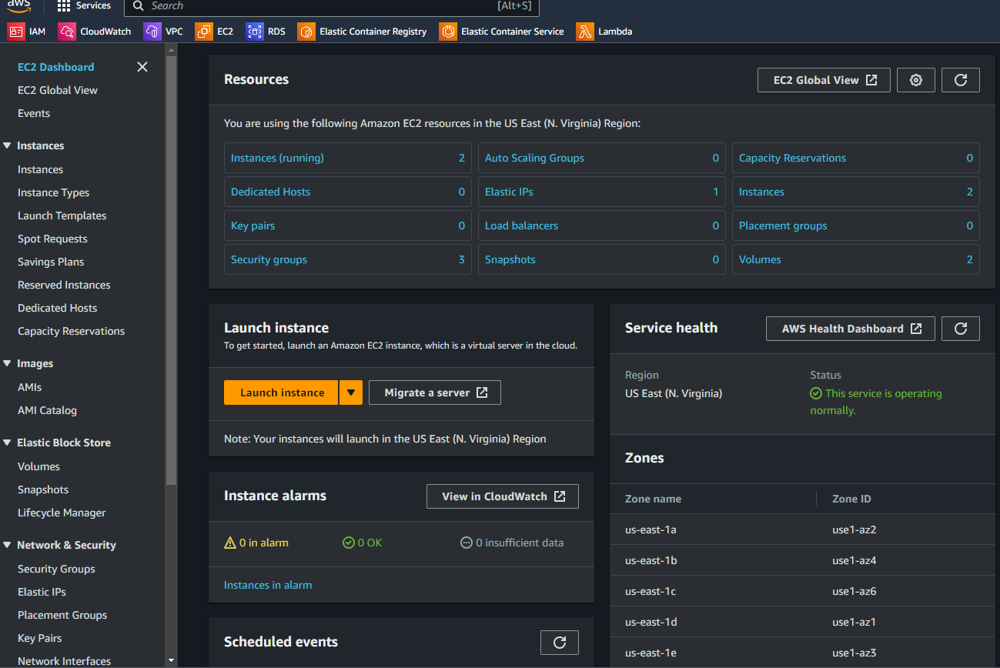
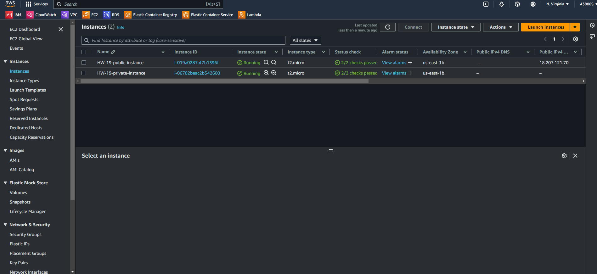
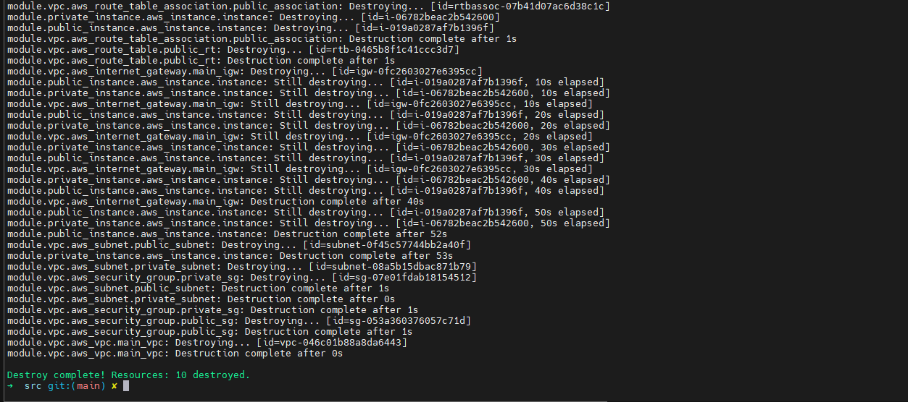

# Виконання завдання HW19 з використанням AWS Terraform VPC

## 1. Створення VPC та EC2 інстансів за допомогою Terraform
1. **Налаштування Terraform для створення VPC**:
   - Створив VPC з публічною та приватною підмережами.
   - Додав інтернет-шлюз для доступу до публічної підмережі.

   

2. **Створення публічного та приватного EC2 інстансів**:
   - Створив два EC2 інстанси: один з публічним доступом, інший — з приватним, доступним через перший інстанс.
   - Використав останній доступний образ AMI для Ubuntu 20.04, використовуючи функцію `filter` для динамічного вибору AMI.

   

## 2. Підтвердження роботи інстансів у AWS
1. **Підтвердження роботи інстансів в AWS Management Console**:
   - Обидва інстанси були успішно створені та доступні через консоль AWS. Публічний інстанс має доступ до Інтернету, тоді як приватний доступний лише через публічний.

   
   

## 3. Знищення ресурсів після перевірки
1. **Знищення всіх створених ресурсів за допомогою команди `terraform destroy`**:
   - Після завершення перевірки всі ресурси були знищені, включно з VPC, EC2 інстансами та пов'язаними ресурсами.

   

## Підсумок
- За допомогою Terraform було створено інфраструктуру з двома EC2 інстансами: один з публічним доступом і один з приватним доступом.
- Після успішного виконання всі ресурси були знищені для оптимізації використання ресурсів AWS.
