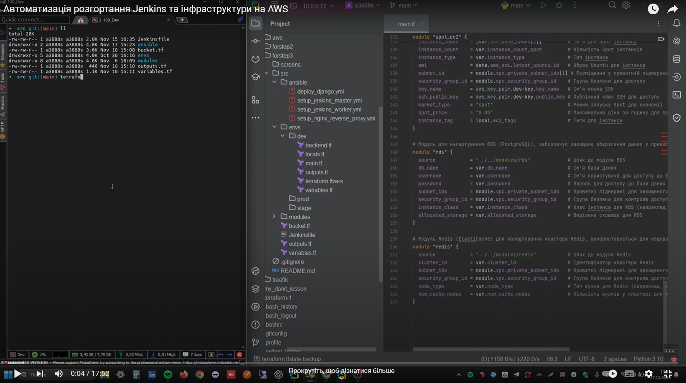
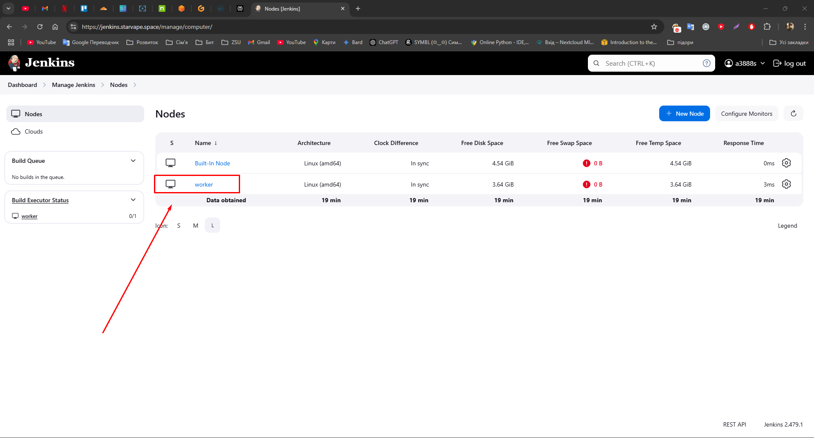
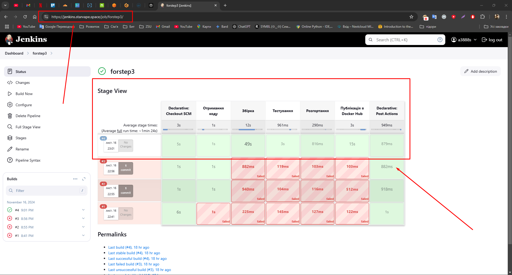
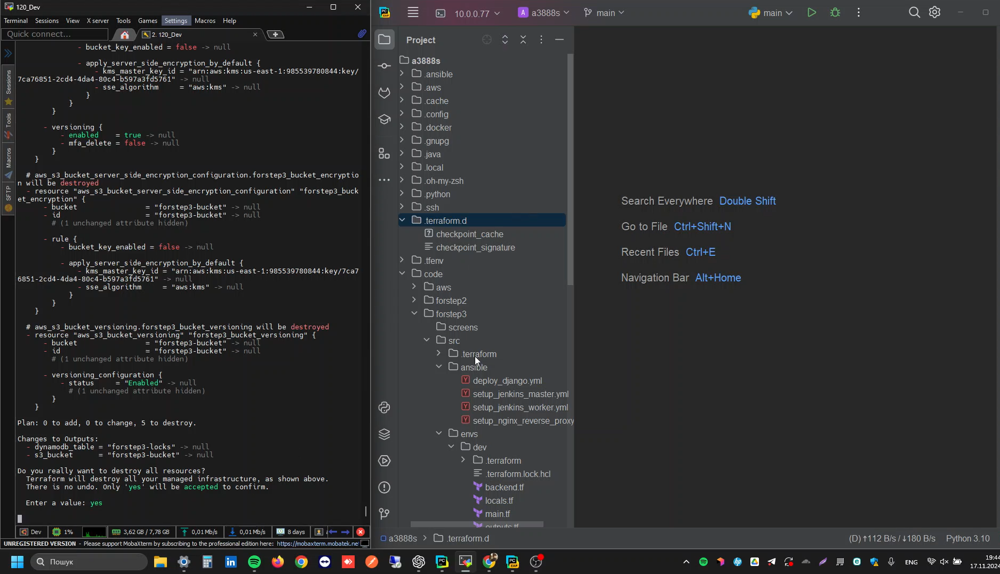

# Автоматизація розгортання Jenkins та інфраструктури на AWS

Цей проєкт демонструє створення інфраструктури AWS за допомогою **Terraform**, налаштування Jenkins Master та Worker через **Ansible**, а також розгортання CI/CD конвеєра.

---

## Структура проєкту

```plaintext
forstep3/
├── README.md                            # Документація проєкту
├── screens/                             # Скріншоти результатів виконання
│   ├── 1.png
│   ├── 2.png
│   ├── 3.png
│   ├── 4.png
│   └── 5.png
├── src/
│   ├── ansible/                         # Playbooks для автоматизації
│   │   ├── deploy_django.yml            # Розгортання Django
│   │   ├── setup_jenkins_master.yml     # Налаштування Jenkins Master
│   │   ├── setup_jenkins_worker.yml     # Налаштування Jenkins Worker
│   │   └── setup_nginx_reverse_proxy.yml # Налаштування Nginx як Reverse Proxy
│   ├── bucket.tf                        # Налаштування S3 для стану Terraform
│   ├── envs/                            # Середовища (dev, stage, prod)
│   │   ├── dev/                         # Налаштування для середовища dev
│   │   │   ├── backend.tf
│   │   │   ├── locals.tf
│   │   │   ├── main.tf
│   │   │   ├── outputs.tf
│   │   │   ├── terraform.tfvars
│   │   │   └── variables.tf
│   │   ├── prod/                        # Аналогічно для середовища prod
│   │   └── stage/                       # Аналогічно для середовища stage
│   ├── modules/                         # Модулі Terraform
│   │   ├── autoscaling/                 # Модуль Auto Scaling Group
│   │   ├── ec2/                         # Модуль EC2
│   │   ├── lb/                          # Модуль Load Balancer
│   │   ├── rds/                         # Модуль RDS
│   │   ├── redis/                       # Модуль Redis
│   │   └── vpc/                         # Модуль VPC
│   ├── outputs.tf                       # Вихідні значення Terraform
│   └── variables.tf                     # Змінні Terraform
```

---

## Відео демонстрація виконання

[](https://youtu.be/i7f3_s-zGS0)


## Кроки розгортання

### 1. Ініціалізація інфраструктури за допомогою Terraform

## Основні каталоги

- **`envs/`**: Містить окремі конфігурації для середовищ **dev**, **stage**, **prod** з унікальними змінними, ресурсами та параметрами.
- **`modules/`**: Містить модулі для **VPC**, **EC2**, **Load Balancer**, **Autoscaling**, **RDS**, **Redis**. Модульна структура спрощує повторне використання та масштабування.
- **`ansible/`**: Містить файли для автоматичного розгортання Jenkins на EC2.

### Попередні налаштування

- **Terraform**: Встановіть Terraform (версія >= 1.0).
- **Ansible**: Встановіть Ansible (версія >= 2.9).
- **AWS CLI**: Налаштуйте AWS CLI з відповідними обліковими даними.
- **SSH Key**: Переконайтеся, що ваш закритий ключ знаходиться в `~/.ssh/id_rsa` для підключення через Ansible.

### Кроки розгортання

1. **Ініціалізація бекенду та створення базових ресурсів**:
   ```bash
   cd src
   terraform init
   terraform apply
   ```

2. **Налаштування інфраструктури для конкретного середовища** (наприклад, для dev):
   ```bash
   cd envs/dev
   terraform init
   terraform apply
   ```

- **Створення EC2 для Jenkins Master і Worker**:
   - Jenkins Master запускається в публічній підмережі.
   - Jenkins Worker розміщений у приватній підмережі.

---

### 2. Налаштування Jenkins через Ansible

- Playbook для встановлення Jenkins Master:
   ```bash
   ansible-playbook -i inventory.ini src/ansible/setup_jenkins_master.yml
   ```
  
- Додавання Worker через playbook:
   ```bash
   ansible-playbook -i inventory.ini src/ansible/setup_jenkins_worker.yml
   ```
  
- Налаштував Nginx на Jenkins Master через playbook:
   ```bash
   ansible-playbook -i inventory.ini setup_nginx_reverse_proxy.yml -l jenkins-master -vv
   ```
---

### 3. Додавання Jenkins Worker до Master

- Після виконання playbook Worker автоматично додається до Jenkins Master.
- Результат можна переглянути в Jenkins:
   

---

### 4. Розгортання CI/CD конвеєра в Jenkins

- Додав pipeline з попереднього **Step Project** у Jenkins. 
- Всі етапи виконуються успішно:
   

---

### 5. Налаштував Nginx на Jenkins Master

- Встановив SSL за допомогою Certbot.
- Налаштував `nginx.conf` для Jenkins Master


---

### 6. Очистка ресурсів

Щоб видалити ресурси середовища:
```bash
cd envs/dev
terraform destroy
```

Щоб видалити глобальні ресурси:
```bash
cd src
terraform destroy
```


## Важливі моменти

1. **Модульна структура**:
   - Модулі для VPC, EC2, RDS, LB та Auto Scaling дозволяють легко адаптувати інфраструктуру.

2. **Масштабування**:
   - Auto Scaling Group забезпечує динамічне масштабування Django додатку.

3. **Безпека**:
   - Налаштовано HTTPS через Certbot для захищеного доступу.

4. **Автоматизація**:
   - Ansible автоматизує всі налаштування серверів і деплой додатку.

5. **Ефективність**:
   - Використання Spot Instances знижує витрати на хостинг Worker-ів Jenkins і EC2 інстансів Django.